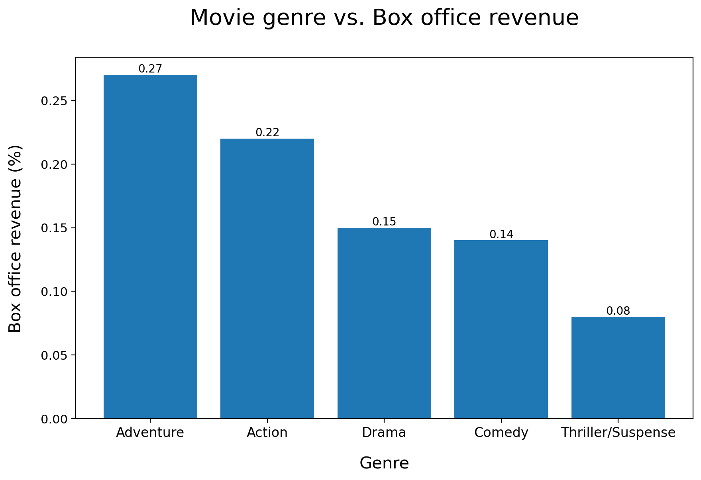
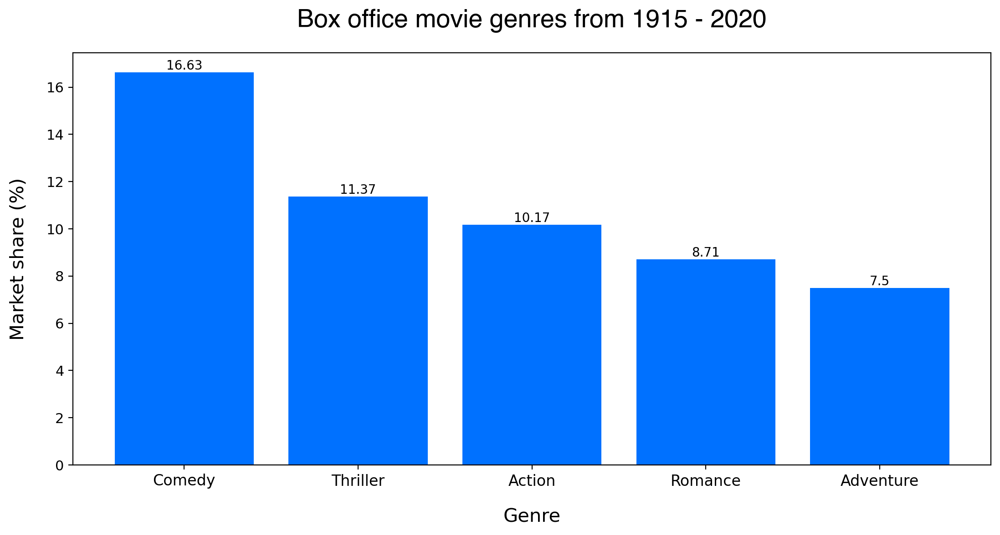
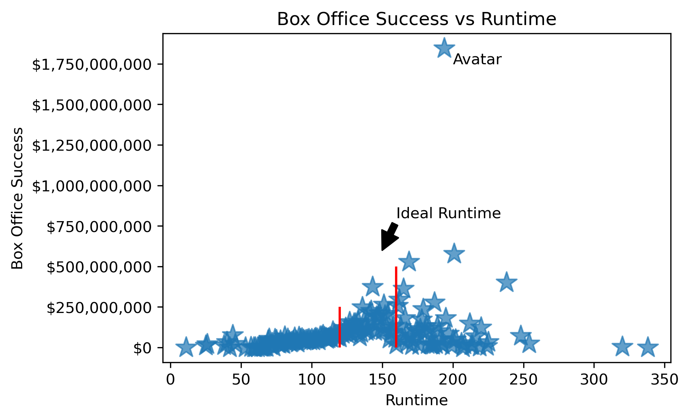

# Microsoft Studio Development Analysis

# Authors: 

Stephanie Ciaccia
 
Gideon Miles
 
Luke Sims
 
## Overview

<<<<<<< HEAD
Microsoft has decided to launch Microsoft Studios as a way to tell the stories of their larger brand and it's subsidaries. As part of this pursuit that have decided to contract us to conduct an exploratory data analysis and extract valuable business insights for internal stakeholders, production and creative teams. From our research from our given datasets and indepdently sourced findings, we have come to make three data backed recommendations to strongly enter this competitive market with effective strategy.

## Business Problem

As a new division it’s important for Microsoft Films to establish Market Credibility and bring a net positive ROI to itself and the larger organization. There concerns are:

What are the variables to making a highly profitable and overall successful film?
From initial research we found Microsoft is in the process of a major acquisition of a game studio called, Activision/Blizzard, recognizing the opportunity for multi-platform growth (Video Games, Series and Movies) we set out to understand:

Is there enough engagement to justify creating a video game franchise, if so which?
Which Genre is the most successful? Are there any specific subgenres we could use to increase marketability?
What is the style the content should be written in (rated G to R)? What runtime best keeps people engaged?
=======
Microsoft has decided to launch Microsoft Studios as a way to tell the stories of their larger brand and it's subsidaries. As part of this pursuit they have decided to contract us conduct an exploratory data analysis and extract valuable business insights for internal stakeholders, production and creative teams. From our research and given datasets and indepdently sourced findings, we have come to make three data backed recommendations to strongly enter this competitive market with effective strategy.

## Business Problem

As a new division it’s important for Microsoft Films to establish Market Credibility and bring a net positive ROI to itself and the larger organization. There concerns are: 

What are the variables to making a highly profitable and overall successful film? 

From initial research we found Microsoft is in the process of a major acquisition of a game studio called, Activision/Blizzard, recognizing the opportunity for multi-platform growth (Video Games, Series and Movies) we set out to understand: 
>>>>>>> b6c3622f809054a4a039462c18f52dc58fefcdea

Is there enough engagement to justify creating a video game franchise, if so which? 
Which Genre is the most successful? Are there any specific subgenres we could use to increase marketability?
What is the style the content should be written in (rated G to R)? What runtime best keeps people engaged? 

## Data

<<<<<<< HEAD
Our original data sets were provided by Microsoft from publicly available datasets including The Numbers, TMBD API, and Box Office Mojo.
=======
Our film data was collected through publicly available datasets including The Numbers, TMBD API, and Box Office Mojo.
>>>>>>> b6c3622f809054a4a039462c18f52dc58fefcdea

The original data sets provided a variety of information on global box office films including title, genre, ratings, budget, domestic and worldwide box office earning. 

<<<<<<< HEAD
Additional data sets we pulled include:

The Twitch data (add information here)
MovieLens data (https://www.kaggle.com/datasets/rounakbanik/the-movies-dataset)
=======
Additional Data Sets are: 

The Twitch data (https://sullygnome.com/games/365/watched)
>>>>>>> b6c3622f809054a4a039462c18f52dc58fefcdea

MovieLens data (https://www.kaggle.com/datasets/rounakbanik/the-movies-dataset)

## Methods

<<<<<<< HEAD
We collabratively used a variety of descriptive statistics, including measures of central tendency and variability to represent our findings.

Our data sets we're a combination of those provided by the client and also data sets we found on our volition, which we as a team analyzed, discussed and then merged.

=======
We collabratively used a variety of descriptive statistics, including measures of central tendency and variability to represent our findings. 
Our data sets we're a combination of those provided by the client and also data sets we found on our volition, which we as a team analyzed, discussed and then merged. 
>>>>>>> b6c3622f809054a4a039462c18f52dc58fefcdea

## Results

- **Content/IP** - Microsoft will be purchasing roughly 25% of top viewed IP's on Twitch. A further breakdown of which of the popular IP's are worth investing. 

<<<<<<< HEAD

=======

>>>>>>> b6c3622f809054a4a039462c18f52dc58fefcdea

<<<<<<< HEAD

- **Ratings & Runtime** The most succesful film's by rating fall into the PG and PG13 additionally they also have the characteristics of 120-160 minutes.

=======
- **Genre** -The highest-grossing movie genres by worldwide box office are action and adventure. Action and adventure films make up 86% of all revenue for movies from 1995 - 2025, though Comedy is the top produced genre. 

- **Ratings & Runtime**- The most succesful film's by rating fall into the PG and PG13 additionally they also have the characteristics of 120-160 minutes. 
>>>>>>> b6c3622f809054a4a039462c18f52dc58fefcdea

## Conclusions:

<<<<<<< HEAD
- **Content/IP** - NEEDS TO BE UPDATED - Microsoft should utilize its extensive portfolio of popular video game intellectual property to create content. With the impending acquisition of Activision, Microsoft will make up approximately 28% of all viewers on Twitch, one of the top 5 major live streaming platforms, Microsoft is positioned to significantly enhance its market share in the video game space.

- **Genre** - Based on the analysis of the top-grossing film genres spanning from 1915 to 2022, it is advisable that Microsoft Studios focuses on utilizing their intellectual properties to produce Action-Adventure Films, which have historically been the most lucrative genres. This approach is likely to result in maximum profitability for the company.

- **Ratings & Runtime** - To optimize their market share and appeal to a wide audience, Microsoft should produce a film with a rating falling within the G to PG-13 range. Also supported by the evidence is that microsoft film studios should structure it's content to have a runtime of 120 to 160 to have the highest success and box office earnings.
=======
- **Content/IP** - Microsoft should utilize its extensive portfolio of popular video game intellectual property to create content. Specifically in conjuction with their newest acquision of Activision/Blizzard, Microsoft will make up approximately 28% of all viewers on Twitch, one of the top 5 major live streaming platforms, Microsoft is positioned to significantly enhance its market share in the video game space.

- **Genre** - Based on the analysis of the top-grossing film genres spanning from 1915 to 2022, it is advisable that Microsoft Studios focuses on utilizing their intellectual properties to produce Action-Adventure Films, which have historically been the most lucrative genres. This approach is likely to result in maximum profitability for the company.

- **Ratings & Runtime** - To optimize their market share and appeal to a wide audience, Microsoft should produce a film with a rating falling within the G to PG-13 range. Also supported by the evidence is that microsoft film studios should structure it's content to have a runtime of 120 to 160 to have the highest success and box office earnings. 
>>>>>>> b6c3622f809054a4a039462c18f52dc58fefcdea

## Next steps:

The datasets employed for our analysis were pulled from publicly available sources, and do not include cross-platform measurement data. In this regard, we recommend the utilization of Nielsen, a leading global provider of audience insight, data, and analytics, to obtain additional data and gain deeper insights into the television, film, content and digital landscape. 

To succeed, Microsoft Studio must maintain exceptional creative standards and collaborate with talented individuals capable of producing original and captivating narratives. To this end, executives spearheading the studio's efforts should allocate significant time and resources towards recruiting a robust team of production executives, thereby establishing the studio for optimal success. It is imperative to seek out exceptional talent from major studios and production companies, with a focus on top-tier producers, directors, and writers who possess in-depth industry knowledge.

Furthermore, we recommend conducting thorough research on Microsoft's intellectual property portfolio and revenue streams to evaluate the feasibility of implementing multi-platform strategies that can complement the production of film and television content.

## For more information:

See the fully analysis in the [Jupyter notebook](https://github.com/stephcia/Microsoft_Film_Project) or to review the presentation.

